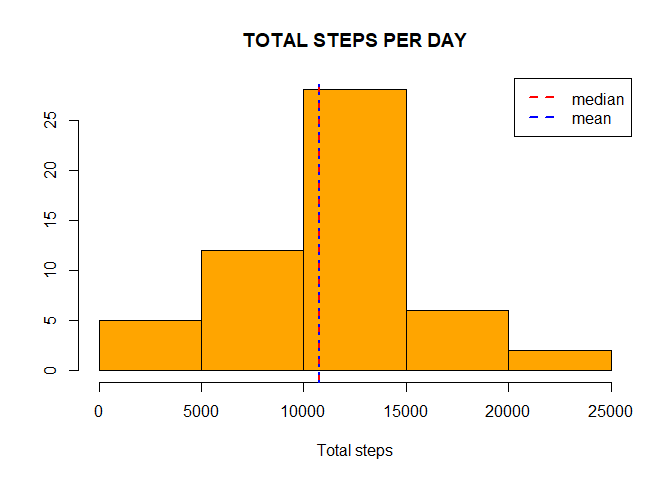

## LOADING AND PREPROCESSING DATA
Pull out the file activity.csv to read, explore and analyse!!

```r
activity <- read.csv("activity.csv")
str(activity)
```

```
## 'data.frame':	17568 obs. of  3 variables:
##  $ steps   : int  NA NA NA NA NA NA NA NA NA NA ...
##  $ date    : chr  "2012-10-01" "2012-10-01" "2012-10-01" "2012-10-01" ...
##  $ interval: int  0 5 10 15 20 25 30 35 40 45 ...
```

```r
summary(activity)
```

```
##      steps            date              interval     
##  Min.   :  0.00   Length:17568       Min.   :   0.0  
##  1st Qu.:  0.00   Class :character   1st Qu.: 588.8  
##  Median :  0.00   Mode  :character   Median :1177.5  
##  Mean   : 37.38                      Mean   :1177.5  
##  3rd Qu.: 12.00                      3rd Qu.:1766.2  
##  Max.   :806.00                      Max.   :2355.0  
##  NA's   :2304
```
### Loading the data

```r
library(plyr)
library(lattice)
library(ggplot2)
```
### Processing and Cleaning the data

```r
activity$day <- weekdays(as.Date(activity$date))
clean <- activity[!is.na(activity$steps), ]
```
## AVERAGE STEPS PER DAY PATTERN
### Creating the aggregate function

```r
sumsteps <- aggregate(activity$steps~activity$date, FUN = sum)
colnames(sumsteps) <- c("dates", "Steps")
head(sumsteps)
```

```
##        dates Steps
## 1 2012-10-02   126
## 2 2012-10-03 11352
## 3 2012-10-04 12116
## 4 2012-10-05 13294
## 5 2012-10-06 15420
## 6 2012-10-07 11015
```

### Histogram plot

```r
hist(sumsteps$Steps, ylab = "", xlab = "Total steps", breaks = 5, col = "orange", main = "TOTAL STEPS PER DAY")
abline(v = median(sumsteps$Steps), lty = 2, lwd = 2.5, col = "red")
abline(v = mean(sumsteps$Steps), lty = 3, lwd =2.5, col = "blue")
legend("topright", legend = c("median","mean"), col = c("red","blue"), lty = 2, lwd = 2.5)
```

<!-- -->
### Report the mean and median of the dataset

```r
mean(sumsteps$Steps)
```

```
## [1] 10766.19
```

```r
median(sumsteps$Steps)
```

```
## [1] 10765
```
## Time series plot of the average steps taken using ggplot
### Make a ggplot pattern

```r
intervals <- ddply(clean, .(interval), summarize, Avg =  mean(steps))
ggplot(intervals, aes(interval, Avg, col = "red")) + ggtitle("AVERAGE NO.OF STEPS PER DAY") +
  geom_line() + labs(x = "Time Interval", y = "Average steps")
```

<!-- -->

### The 5-minute interval that, on average, contains the maximum number of steps???

```r
maximum <- max(intervals$Avg)
intervals[intervals$Avg == maximum, 1]
```

```
## [1] 835
```
## Impute missing values
### Calculate total number of missing values??

```r
nrow(activity[is.na(activity$steps), ])
```

```
## [1] 2304
```
My strategy for filling out the NA values is to replace those values with the average steps per day on the basis of interval and day!!

```r
avgsteps <- ddply(clean, .(interval,day), summarize, Avg = mean(steps))
na <- activity[is.na(activity$steps), ]
new <- merge(na, avgsteps, by = c("interval", "day"))
head(new)
```

```
##   interval      day steps       date      Avg
## 1        0   Friday    NA 2012-11-09 0.000000
## 2        0   Friday    NA 2012-11-30 0.000000
## 3        0   Monday    NA 2012-10-01 1.428571
## 4        0   Monday    NA 2012-10-08 1.428571
## 5        0 Saturday    NA 2012-11-10 0.000000
## 6        0   Sunday    NA 2012-11-04 0.000000
```

```r
new2 <-new[ , c(5,4,1,2)]
colnames(new2) <- c("steps", "date", "interval", "day")
data <- rbind(clean, new2)
head(data)
```

```
##     steps       date interval     day
## 289     0 2012-10-02        0 Tuesday
## 290     0 2012-10-02        5 Tuesday
## 291     0 2012-10-02       10 Tuesday
## 292     0 2012-10-02       15 Tuesday
## 293     0 2012-10-02       20 Tuesday
## 294     0 2012-10-02       25 Tuesday
```
### Histogram plot for imputed and non imputed values

```r
sumsteps2 <- aggregate(data$steps~data$date, FUN = sum)
colnames(sumsteps2) <- c("date","Steps")
mean(sumsteps2$Steps)
```

```
## [1] 10821.21
```

```r
median(sumsteps2$Steps)
```

```
## [1] 11015
```

```r
hist(sumsteps2$Steps, xlab = "steps", ylab = "", main ='IMPUTED AND NON IMPUTED DATA',col = "green")
hist(sumsteps$Steps, xlab = "steps", ylab = "", main ='IMPUTED AND NON IMPUTED DATA',col = "yellow", add = T)
legend("topright", legend = c("imputed data", "non imputed data"), lty = 1, lwd =2.5, col = c("green","yellow"))
```

<!-- -->

## Comparing the average number of steps taken per 5-minute interval across weekdays and weekends

```r
data$daycategory <- ifelse(data$day %in% c("Saturday", "Sunday"), "weekend", "weekday")
intervals <- ddply(data, .(interval,daycategory), summarize, Avg = mean(steps))
head(intervals)
```

```
##   interval daycategory      Avg
## 1        0     weekday 2.310714
## 2        0     weekend 0.000000
## 3        5     weekday 0.450000
## 4        5     weekend 0.000000
## 5       10     weekday 0.175000
## 6       10     weekend 0.000000
```
### Lattice plot

```r
xyplot(Avg~interval|daycategory, data = intervals,type = "l", layout = c(1,2), xlab ="interval", ylab = "steps average", main = "Average steps difference pattern")
```

<!-- -->

